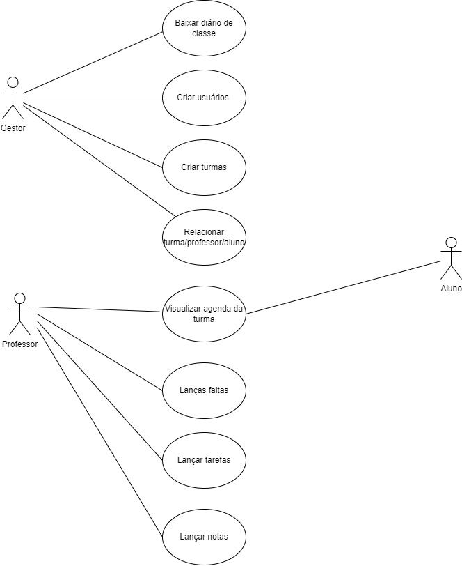

# Especificações do Projeto

A definição exata do problema e os pontos mais relevantes a serem tratados neste projeto foi consolidada com a participação dos usuários em um trabalho de imersão feita pelos membros da equipe a partir da observação dos usuários em seu local natural e por meio de entrevistas. Os detalhes levantados nesse processo foram consolidados na forma de personas e histórias de usuários.

## Personas

<b>Persona 1: Alessandra Gomes</b>

Ocupação: Diretora  Geral Escolar
Descrição: Alessandra é uma Diretora bastante flexível em seu ambiente de trabalho, ela ama liderar a instituição de ensino e gosta de propor e aplicar mudanças. Mesmo com sua dificuldade em tecnologia, ela sempre está buscando meios de aprender a lidar com a mesma e manter a escola 'conectada'.
 Necessidades e Metas: Deixar o ambiente de trabalho o mais agradável possível, para garantir maior satisfação dos funcionários, assim, todos podendo trabalhar em seu máximo potencial.

<b>Persona 2: Josiel Almeida</b>

Ocupação: Vice Diretor Escolar
Descrição: Josiel gosta de inspirar os demais funcionários a resolver diversos desafios, focado em desenvolvimento pessoal, ele está sempre buscando novas inspirações e aprendendo como concretizar e apoiar da melhor forma a diretora em decisões administrativas relacionadas à escola.
 Necessidades e Metas: Estipular metas, prazos e garantir que os projetos escolares sejam concluídos.

<b>Persona 3: Raelen Gabriela</b>

Ocupação: Coordenadora Pedagógica
Descrição: Raelen, é uma coordenadora que trabalha em prol de facilitar a vida dos professores na escola, sempre pensando uma melhor forma de criar uma estrutura de ensino eficaz, agrupando alunos por turmas de acordo com o grau de conhecimento, assim, facilitando os professores a não ter alunos com níveis discrepantes de conhecimento dentro de sala de aula.
 Necessidades e Metas: Reduzir o trabalho manual em relação a pesquisa sobre os níveis dos alunos e conseguir uma maior taxa de aprendizado/aprovação dos alunos mais fracos.

<b>Persona 4: Thais de Paula</b>

Ocupação: Professora de Ensino Fundamental
Descrição: Thais é uma professora que tem um amor gigantesco com seus alunos, ela os inspira da melhor forma a se tornarem grandes profissionais no mercado de trabalho. A professora não lida muito bem com tecnologia, e ela sempre está procurando algo para facilitar seu trabalho, pedindo recomendações aos seus alunos sobre como pesquisar melhor este tipo de conteúdo.
 Necessidades e Metas: Aprender a lidar com tecnologia para facilitar sua forma de lecionar.

<b>Persona 5: Letícia Scarabelli</b>

Ocupação: Professora de Ensino Superior
Descrição: Como professora de Engenharia Civil, Léticia está sempre utilizando vídeos e Slides para exemplificar conteúdos ensinados em sala de aula. Cálculos complexos, formas de pensar, são uma das coisas abordadas na engenharia civil. Sendo uma professora moderna, Leticia faz bastante uso de aplicativos para complementar seu método de ensino.
 Necessidades e Metas: Garantir que seus alunos sejam profissionais incríveis no ramo da engenharia e para isso, ela tem que garantir que todo conteúdo passado nas aulas foi de fato absorvido por seus alunos.

<b>Persona 6: Leonardo Vieira</b>

Ocupação: Professor de Educação Física
Descrição: Além de educador físico, Leonardo também trabalha como personal para garantir uma maior renda e por amor a profissão. Geralmente, Leonardo é o professor preferido, seus alunos amam o modelo de aula dinâmica e adoram ser desafiados nas provas do professor, já que elas sempre envolvem alguma atividade física de fato.
 Necessidades e Metas: Leonardo busca garantir que seus alunos tenham uma vida saudável e entendam que atividades físicas não servem apenas para benefícios estéticos e sim psicológicos de uma maneira geral, assim ajudando eles no âmbito pessoal ou profissional.

<b>Persona 7: Daniele Muneron</b>

Ocupação: Aluna do Ensino Superior
Descrição: Daniele conseguiu seu estágio na área da engenharia, ela se preocupa bastante com suas notas e os prazos de entrega dos trabalhos. Apaixonada por conhecimento, Daniele está sempre buscando melhores maneiras de monitorar seu desempenho escolar, assim podendo observar onde cometeu certos erros e resolvê-los da melhor forma.
 Necessidades e Metas: Acompanhar projetos relacionados a sua turma de forma fácil e rápida.

<b>Persona 8: Uriel Gomes</b>

Ocupação: Aluno do Ensino Médio
Descrição: Carlos é um chef experiente e apaixonado pela culinária. Ele é responsável por supervisionar a cozinha, criar novos pratos e garantir a qualidade dos alimentos. Sua rotina é agitada e ele está sempre em busca de maneiras de otimizar o processo de preparação de alimentos.
 Necessidades e Metas: Ser o melhor aluno de sua classe e planejar o que irá fazer após se formar.

## Histórias de Usuários

De acordo com as personas, identificamos as seguintes historias de usuários:

|EU COMO... `PERSONA`            | QUERO/PRECISO ... `FUNCIONALIDADE`                            |PARA ... `MOTIVO/VALOR`                                    |
|--------------------------------|---------------------------------------------------------------|----------------------------------------------------       |
|Diretora Geral Escolar          |criar ambiente de trabalho prático para os professores         |professores poderem lecionar com qualidade                 |
|Vice Diretor Escolar            |apoiar o diretor e gerir funções administrativas               |os projetos saírem do papel e serem concluídos             |
|Coordenadora Pedagógica         |organizar e planejar projetos escolares junto aos professores  |maior engajamento dos alunos com a instituição             |
|Professora de Ensino Fundamental|facilitar a troca de informações sobre projetos com os alunos  |o aluno poder observar com facilidade os projetos escolares|
|Professora de Ensino Superior   |reduzir a falta de entrega de para casas e trabalhos dos alunos|garantir o aprendizado em relação a compromissos e prazos  |
|Professor de Educação Física    |Lembrar os alunos de se exercitarem em casa                    |eles terem uma maior disposição e qualidade de vida geral  |
|Aluna Ensino Superior           |clareza nas informações em relação a instituição de ensino     |ter um entendimento maior sobre notas, faltas e prazos     |
|Aluno Ensino Fundamental        |conseguir formar com uma das maiores notas da classe           |para suprir as expectativas da minha família               |

## Modelagem do Processo de Negócio 

### Análise da Situação Atual

Apresente aqui os problemas existentes que viabilizam sua proposta. Apresente o modelo do sistema como ele funciona hoje. Caso sua proposta seja inovadora e não existam processos claramente definidos, apresente como as tarefas que o seu sistema pretende implementar são executadas atualmente, mesmo que não se utilize tecnologia computacional. 

### Descrição Geral da Proposta

Apresente aqui uma descrição da sua proposta abordando seus limites e suas ligações com as estratégias e objetivos do negócio. Apresente aqui as oportunidades de melhorias.

### Processo 1 – NOME DO PROCESSO

Apresente aqui o nome e as oportunidades de melhorias para o processo 1. Em seguida, apresente o modelo do processo 1, descrito no padrão BPMN. 

### Processo 2 – NOME DO PROCESSO

Apresente aqui o nome e as oportunidades de melhorias para o processo 2. Em seguida, apresente o modelo do processo 2, descrito no padrão BPMN.

## Indicadores de Desempenho

Apresente aqui os principais indicadores de desempenho e algumas metas para o processo. Atenção: as informações necessárias para gerar os indicadores devem estar contempladas no diagrama de classe. Colocar no mínimo 5 indicadores. 

Usar o seguinte modelo: 

Obs.: todas as informações para gerar os indicadores devem estar no diagrama de classe a ser apresentado a posteriori. 

## Requisitos

As tabelas que se seguem apresentam os requisitos funcionais e não funcionais que detalham o escopo do projeto. Para determinar a prioridade de requisitos, aplicar uma técnica de priorização de requisitos e detalhar como a técnica foi aplicada.

### Requisitos Funcionais

|ID    | Descrição do Requisito  | Prioridade |
|------|-----------------------------------------|----|
|RF-001| Criar mecânica de restrição de acesso aos usuários conforme o seu respectivo nível | ALTA | 
|RF-002| Existencia de três níveis de usuário, onde 1- ADM, 2-PROFESSOR, 3-ALUNO | ALTA |
|RF-003| Habilitar o ação de poder cadastrar novos usuários somente aos usuários ADM | ALTA |
|RF-004| Mecanismo de Login/Logout dos usuários | ALTA |
|RF-005| Permição para que os usuários de nível 2 registre o cronograma de suas aulas de suas respectivas turmas | MÉDIA |
|RF-006| Permição para que os usuários de nível 3 somente visualize o cronograma de aulas de sua respectiva turma  | MÉDIA |
|RF-007| Sistema gráfico que aumente a clareza da visualização do cronograma das aulas por parte dos usuários | MÉDIA |
|RF-008| Possibilitar que o usuário atualize os seus dados cadastrais | BAIXA |

### Requisitos não Funcionais

|ID     | Descrição do Requisito  |Prioridade |
|-------|-------------------------|----|
|RNF-001| O sistema deve ser responsivo para rodar em um dispositivos móvel | MÉDIA | 
|RNF-002| Stack a ser utilizada no desenvolvimento do back-end: Flask, MongoDB | ALTA |
|RNF-003| Stack a ser utilizada no desenvolvimento do front-end: React, ReactNative | ALTA |  
|RNF-004| Deve processar requisições do usuário em no máximo 3s | BAIXA | 
|RNF-005| Segurança: proteção adequada dos dados do usuário| ALTA | 
|RNF-006| Deploy Frontend: Vercel | ALTA | 
|RNF-007| Deploy Backend: Azure | ALTA | 
|RNF-008| Escalabilidade: capacidade de lidar com um aumento significativo no número de usuários sem comprometer o desempenho ou a funcionalidade. | ALTA | 

## Restrições

O projeto está restrito pelos itens apresentados na tabela a seguir.

|ID| Restrição                                             |
|--|-------------------------------------------------------|
|01| O projeto deverá ser entregue até o final do 1° semestre de 2024 |
|02| O idioma do aplicativo será somente em português |

## Diagrama de Casos de Uso

# Matriz de Rastreabilidade

A matriz de rastreabilidade é uma ferramenta usada para facilitar a visualização dos relacionamento entre requisitos e outros artefatos ou objetos, permitindo a rastreabilidade entre os requisitos e os objetivos de negócio. 

A matriz deve contemplar todos os elementos relevantes que fazem parte do sistema, conforme a figura meramente ilustrativa apresentada a seguir.

# Gerenciamento de Projeto

De acordo com o PMBoK v6 as dez áreas que constituem os pilares para gerenciar projetos, e que caracterizam a multidisciplinaridade envolvida, são: Integração, Escopo, Cronograma (Tempo), Custos, Qualidade, Recursos, Comunicações, Riscos, Aquisições, Partes Interessadas. Para desenvolver projetos um profissional deve se preocupar em gerenciar todas essas dez áreas. Elas se complementam e se relacionam, de tal forma que não se deve apenas examinar uma área de forma estanque. É preciso considerar, por exemplo, que as áreas de Escopo, Cronograma e Custos estão muito relacionadas. Assim, se eu amplio o escopo de um projeto eu posso afetar seu cronograma e seus custos.

## Gerenciamento de Tempo

Com diagramas bem organizados que permitem gerenciar o tempo nos projetos, o gerente de projetos agenda e coordena tarefas dentro de um projeto para estimar o tempo necessário de conclusão.

O gráfico de Gantt ou diagrama de Gantt também é uma ferramenta visual utilizada para controlar e gerenciar o cronograma de atividades de um projeto. Com ele, é possível listar tudo que precisa ser feito para colocar o projeto em prática, dividir em atividades e estimar o tempo necessário para executá-las.

## Gerenciamento de Equipe

O gerenciamento adequado de tarefas contribuirá para que o projeto alcance altos níveis de produtividade. Por isso, é fundamental que ocorra a gestão de tarefas e de pessoas, de modo que os times envolvidos no projeto possam ser facilmente gerenciados. 

## Gestão de Orçamento

O processo de determinar o orçamento do projeto é uma tarefa que depende, além dos produtos (saídas) dos processos anteriores do gerenciamento de custos, também de produtos oferecidos por outros processos de gerenciamento, como o escopo e o tempo.

